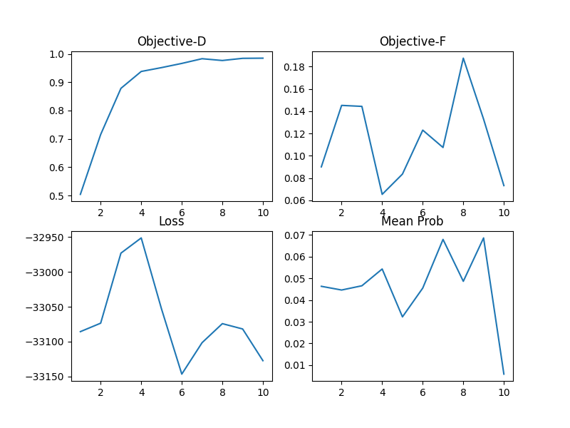

# agns-port
Repository for the Python port of the "agns" (Adversarial Generative Networks) paper.

## Requirements
- Python 3.8+
- the packages listed in the requirements.txt
- plus pyviz package and Graphviz additionaly if you want graphs of the models
(comment out `plot_model` to ignore)
- at least one NVidia GPU, with 11+ GB VRAM recommended
- the correct NVidia CUDA version + CUDNN installed
- at least 2 GB of free storage

## Dependencies
Install requirements in your venv with `pip install -r requirements.txt`.
Python 3.8 recommended.
It is *not* recommended using another Tensorflow, Numpy version etc. than provided. Especially Tensorflow can cause
some unexpected problems with this.
The code has a directory 'dependencies' that just contains a shape predictor file and a script that calls Python
bindings for Dlib.

## Images
The files (glasses dataset, PubFig dataset) are provided. Because the original, full PubFig dataset could
not be downloaded from the main source, a third-party provided subset was used. From there, 143 directories were
selected. Those give the basis for the 143 classes. Another subset of those classes was chosen for the 10 classes
problem formulation, as the non-celebrity (researcher) images were not provided.

Only a few images of the researcher(s) were given. This is not sufficient to include them as targets
in a face recognition network, but enough to perform impersonation attacks.

At the top level directory, a shell script 'align_all.sh' is provided, in case you want to create aligned versions
from the original images again, you can e.g. execute `bash align_all.sh` (it will take some minutes).
It uses Dlib to align face images to a 68-landmark pose.

#### Datasets (data/)

| Directory | What | # Images |
| :---------| :----| :--------|
| eyeglasses | normal eyeglasses images (+ 1 mask) | 16681 |
| eyeglasses/cropped | eyeglasses images cropped to 64x176 | 16680 |
| pubfig/dataset_ | some celebrities from PubFig (143) | 6551 |
| pubfig/dataset_10 | 10 selected celebrities from dataset_ | 321 |
| pubfig/dataset_aligned | images from dataset_ aligned to 68-landmarks-pose | 6551 |
| pubfig/dataset_aligned_10 | aligned version of dataset_10 | 321 |
| demo-data2 | researcher Mahmood Sharif wearing glasses with green marks | 6 |

## Models
The face recognition models are based on VGG-16, as well as FaceNet (OpenFace) small version.
The models were trained on aligned images in the given PubFig dataset.
The DCGAN´s purpose is to generate fake eyeglasses, just like those in the provided eyeglasses
dataset. As small change to the paper, mini-batch discrimination was added to the generator
in order to have a wider diversity of colors, and slightly better looking results.

#### Face Recognition Models (networks/face_nets.py)

| Model | Based on | Save name | Size (params) | Image input size | Values input range | Trained on |
| :-----| :--------| :---------| :-------------| :----------------| :------------------| :--------- |
VGG10   | VGG-16   | vgg_10.h5 |   134,301,514 | 224 x 224        | [0., 1.] | pubfig/dataset_aligned_10
VGG143  | VGG-16   | vgg_143.h5|   134,846,415 | 224 x 224        | [0., 1.] | pubfig/dataset_aligned
OF10    | FaceNet  | of10.h5   |     3,744,958 | 96 x 96          | [-1., 1.] | pubfig/dataset_aligned_10
OF143   | FaceNet  | of143.h5  |     3,821,215 | 96 x 96          | [-1., 1.] | pubfig/dataset_aligned

#### DCGAN (networks/dcgan.py, dcgan_utils.py, eyeglass_discriminator.py, eyeglass_generator.py)
The parts of the DCGAN (Deep Convolutional Adversarial Generative Network) model used for generating eyeglasses.
The only difference in the architecture (compared to the paper) is additional mini-batch discrimination that
was used to generate more diverse and slightly better fake images. Note that 'mode collapse' is still possible,
as it is a problem of GANs in general.

| Model | Save Name | Size (params) | Output | Values input range |
| :-----| :---------| :-------------| :------| :------------------|
| Generator | gweights (TF format) | 633,403 | 64 x 176 RGB image | (standard) normal distribution |
| Discriminator | dweights (TF format) | 3,809,801 |  value in [0., 1.], confidence fake/real | [-1., 1.] |

#### Special Layers (networks/special_layers.py)

| Class Name | Functionality |
| :----------| :-------------|
| LocalResponseNormalization | LR normalization within specific radius |
| L2Pooling | special average pooling with Euclidean norm |
| L2Normalization | just Euclidean norm |
| InceptionModule | 'original' Inception Module, four parallel Conv/Pool paths |
| InceptionModuleShrink | similar, but only three paths, and shrinks image |
| BlackPadding | pads glasses images with black, also applies mask to remove artifacts |
| FaceAdder | merges fake glasses and faces |
| Resizer | resizes images (might also scale values) |

## Training
There are already pretrained models provided in saved-models. If you want to train the face recognition
models (VGG / OpenFace 10/143), go to `face_nets.py`. It has two functions to train those models
from scratch, or also to continue training existing models.
If in the right directory ('../../saved-models') saved models exist, the training continues from that
checkpoint, otherwise training is started from the begin.
The VGG models are easier to train.
The training function for those is `train_vgg_dnn`. Pay attention that the parameter `bigger_class_n`
determines whether the 143-class version is trained, or the 10-class one.
For
training the OpenFace models, it is very recommended to properly pretrain the base model first with
`pretrain_openface_model`. Then, if the loss is considerably low, continue and train the full model
with `train_of_dnn`.

There is no guarantee to succeed at reaching your goal when training a deep learning model. It is
highly non-deterministic, and different things can go wrong. In general, it is good practice to
keep a validation set during training, verify model functionality by hand, and better train a
model n times for x epochs, instead of training it for n * x epochs straight. Why?
At least here in this code, the training and validation splits are different each time. This means
each time, the alignment of data is different. Also it makes sense to change the learning rate between
different training sessions, decreasing it over time. The validation accuracy is a weak, but useful
indicator how much a model is progressed. Don´t train a model too much: this means it overfits to
the data, and thus generalizes poorly. If the validation accuracy only drops for an extended period
of time, this is an indicator of overfitting. It is recommended to finish the training process at a
rather stable validation accuracy.

Trained models can be loaded with `tf.keras.load_model`. The most popular save formats are .h5 and
the Tensorflow format (recognized by .index / .data-... endings). Some models, particularly those
that use custom implemented layers that receive extra parameters, need to be loaded with explicitly
given custom objects to be restored.

## Code Remarks
Functions not used anymore are marked with a DepreciationWarning. They still might be useful, but are
not necessarily tested with the current state of the code. There is also a deprecated package.
There are some code snippets in functions left commented out. Their purpose was to show or
save images, intermediate results in different functions.

## Using other face classifiers
It´s possible to use other (Tensorflow based) face recognition networks, besides the ones provided
here. The network needs to be a multi-classifier, so that 'Softmax' is the last computation at the
end of the neural network. If your model fulfills that condition and has the Softmax as last layer,
`execute_attack` can be called with parameter `strip_last_layer` set to 'True' with the model path.

If this is not the case, but your model is a classifier and ends with a Softmax, you can still
use it. E.g. load the model, create a copy of it, transfer its weights, save the last layer´s
weights in a variable, then remove the last layer in the copy, and add it back instead without
Softmax activation, set its weights to the variable, and finally add a `tf.keras.layers.Softmax`.
If you´ve done this or something else with the same result, you can just save it again, and
provide its path to `execute_attack`. If you have a model that doesn´t output probabilities
but logits,
you can set `strip_last_layer` to 'False' to pass the full model instead.

Also pay attention to your model´s image input size, and the expected value range. Because
`execute_attack` has a parameter `vgg_not_of`. If it is 'True', the expected image size is 224x224,
and the value range between 0 and 1. But if it is set to 'False', the expected size is 96x96, with
values between -1 and 1. This is important, because size and range need to be correct for a
face classifier to work as expected.

## Execution
There are different demos, all files that are mainly demonstrating functionality (but might do
more) start with 'demo'. Go to demo_main and start the script, that lets you pick which of the
normal demos to execute. You can specify the GPU(s) to use in parameter `gpus`.

Also take note that content plotted with Matplotlib remotely will show up in the SciView of
PyCharm Pro.

### Demos

| File | Purpose |
| :----| :-------|
| demo_main.py | launch other demos
| demo_face_recognition.py | select and test face recognition models
| demo_generate_eyeglasses.py | generate fake eyeglasses
| demo_dodging.py | perform dodging attack
| demo_impersonation.py | perform impersonation attack
| demo_impersonation_real.py | perform physical impersonation attack

### Explanations

#### Face Recognition
You can choose a face classifier and a target class
by entering the numbers as explained by the running program.
Once you´ve chosen both things, five random images from the target class will be selected
for inference on the face recognition network.
Then, the network will classify the images. The results will be printed to the console, and
also visualized with plots. On the console, the predicted classes are output, together with
their respective confidences. The plot shows every face image together with its predicted class
(including class index) and the confidence.

*Example:*

Here, Jack Nicholson is recognized correctly: the face classifier predicts his class (Jack_Nicholson)
with class index 9 (indices between 0 and 9 for 10-class problem), and 100% confidence (1.0).

#### Generate Eyeglasses
The trained generator (part of the DCGAN) will be loaded. When requested, enter an integer number
and press ENTER. Then, a random vector will be generated as input for the generator. The generator´s
output is then a batch of generated fake glasses, looking like those in the given dataset.
A plot with sixteen generated glasses is shown.

*Example:*

Those glasses are all fake, generated by the generator of the DCGAN trained on lookalike image
data. On some of them, small artifacts are visible. They are removed when applying the given
mask.

#### Dodging
The dodging attack means the target person tries to evade being recognized by the face classifier
by using generated fake glasses of the generator, which receives gradients from not only the
discriminator, but also the face classification network.

***The statistics in the attack plots:***

*Objective-D:* This is the average confidence that the discriminator has in a batch that contains
both real and fake glasses. The closer to 1, the more realistic are the (altered) fake glasses.

*Objective-F:* The average confidence of the face classifier that images of the target class merged
with generated fake glasses belong to the target class. The lower, the more successful a
dodging attack is; the higher, the more successful an impersonation attack.

*Loss:* A special loss for the face classifiers here during the attacks. To maximize the probability
of a successful dodging attack, the AGN must minimize target class logit minus
 the sum of all other classes´ logits. Contrary, to maximize impersonation attack success,
the target class logit must be higher than the sum of all other logits.
The loss is weakly correlated with Objective-F. The goal during dodging attacks is to minimize the loss,
and impersonators want to maximize it instead.

*Mean Prob:* Opposed to Objective-F, this average confidence is calculated after every attack epoch.
Also, the metric is not computed the same way. The mean prob is the best (lowest for dodging,
highest for impersonation attack) average confidence that is computed for any generated fake
glasses merged with all face images of an attacker. It also tends to converge together with
Objective-F.

Example:

In this case, Objective-D increases pretty consistently, which means the fake glasses are almost
indistinguishable after a few attack epochs. Objective-F is unstable, and goes up after it
decreased, but goes down when the attack succeeds. The loss behaves rather similarly.
The mean prob moves a bit in parallel, but only at the end goes down, just after it went up.
Here, Danny Devito dodged VGG143 successfully as mean prob went below the threshold (1%) after
ten attack epochs.

#### Impersonation

In this example, Eva Mendes wants to impersonate Barack Obama against OF10.
Objective-D goes up quickly and stabilizes at a level of around 0.95. The loss has lots of jitter
in its movement, but seems to increase pretty steadily - which is the goal for the impersonation
attack. The mean probability, which the attacker wants to be as high as possible, cannot reach
the desired level to call the impersonation successful, and somehow stagnates after a while.
However, the correlated Objective-F increases rather consistently, even with lots of noise.

#### Physical Impersonation

The researcher and co-author of the paper Mahmood Sharif tries to impersonate George Clooney against
VGG10. Opposed to the other attacks that were purely 'digital', in this case the attacker wears
a physical model of glasses that generated fake glasses are mapped onto. The impersonation succeeds
after only one attack epoch, with extremely high confidence. Objective-D is not that high,
which seems to be because the attack is executed for only one epoch, where other attacks also
tend to start off with a lower Objective-D.

